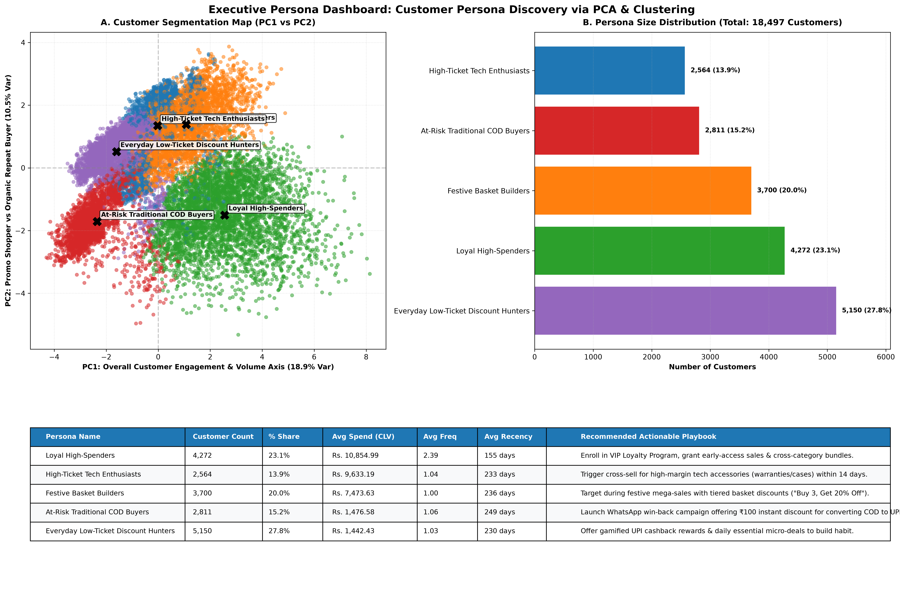
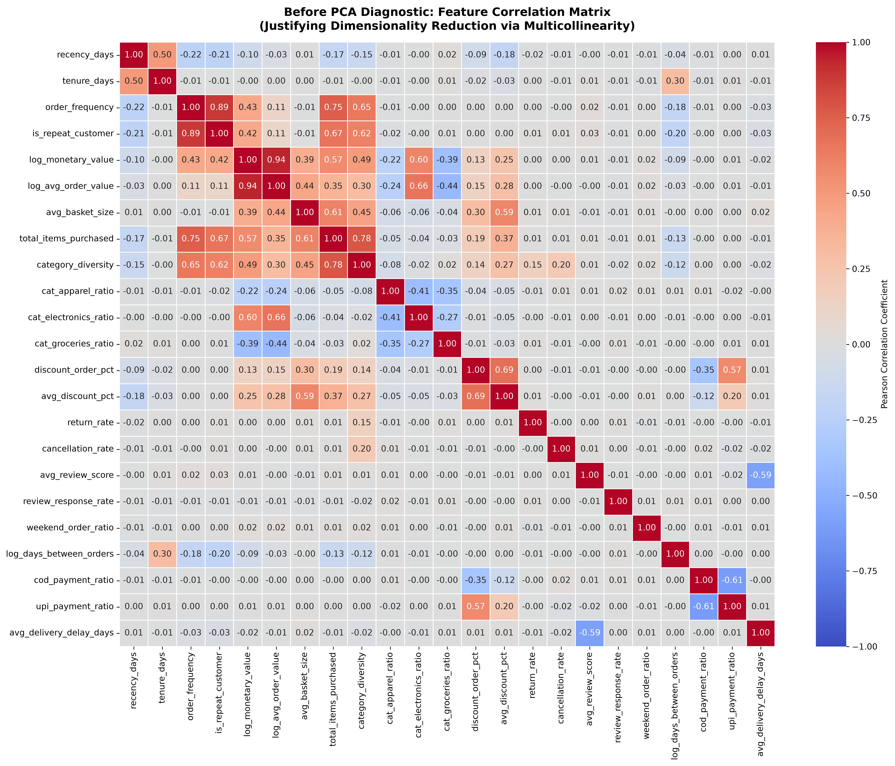
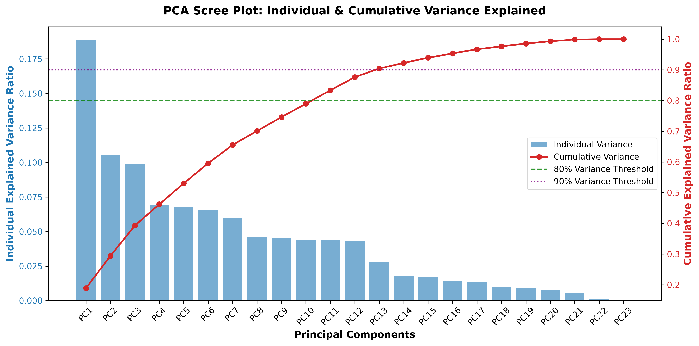
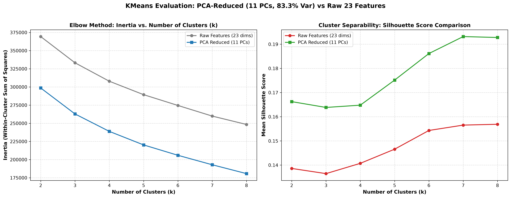

# Customer Persona Discovery via PCA & Clustering

**Author:** Product Analyst / Business Analyst Candidate  
**Target Roles:** Product Analyst, Business Analyst, Data Analyst  
**Dataset:** Synthetic Indian E-Commerce Customer Behavioral Dataset (18,497 Delivered Customers)  
**Repository:** [customer-persona-pca-clustering](https://github.com/Ayusshhhhh01/customer-persona-pca-clustering.git)

---

## 📌 Executive Summary

This project compresses **23 correlated customer behavioral metrics** into orthogonal principal components using **Principal Component Analysis (PCA)**, then applies **KMeans Clustering** to segment 18,497 delivered e-commerce customers into **5 actionable, business-named customer personas**.

Rather than treating PCA as a black-box dimensionality reduction step, this project demonstrates how PCA eliminates feature correlation and enhances cluster separability—achieving a **+19.50% improvement in Silhouette Score** over clustering on raw features alone.



---

## 🎯 Business Problem & Context

E-Commerce platforms often struggle to segment customers effectively due to collinearity across metrics (e.g., total spend, basket size, purchase frequency, and category diversity are all highly correlated). 

Generic RFM (Recency, Frequency, Monetary) rules miss critical behavioral nuances such as **payment channel preferences (COD vs. UPI)**, **festive season basket building**, and **category domain specialization (Electronics vs. Everyday Groceries)**.

### Core Objectives:
1. **Reduce Multicollinearity**: Compress 23 overlapping behavioral metrics into a lower-dimensional orthogonal space.
2. **Quantify PCA Value**: Prove that clustering on PCA-reduced components yields cleaner, more separable clusters than raw data.
3. **Build Actionable Personas**: Translate mathematical clusters into 5 named customer personas with tailored business growth strategies.

---

## 🛠️ End-to-End Methodology


### 1. Feature Engineering (23 Behavioral Metrics)
Extracted customer-level signals from transaction tables (`orders`, `order_items`, `delivery_info`, `reviews`, `customers`):
* **Monetary & Basket Scale**: `log_monetary_value`, `log_avg_order_value`, `avg_basket_size`, `total_items_purchased`.
* **Engagement & Cadence**: `recency_days`, `order_frequency`, `is_repeat_customer` (binary flag), `log_days_between_orders`, `tenure_days`.
* **Category Preference**: `category_diversity`, `cat_apparel_ratio`, `cat_electronics_ratio`, `cat_groceries_ratio`.
* **Promotional & Friction Signals**: `discount_order_pct`, `avg_discount_pct`, `return_rate`, `cancellation_rate`.
* **Payment & Logistics Channels**: `upi_payment_ratio`, `cod_payment_ratio`, `avg_delivery_delay_days`, `avg_review_score`, `review_response_rate`, `weekend_order_ratio`.

> **Key Preprocessing Decision**: Applied `log1p()` transformation to heavily right-skewed monetary and cadence metrics (`monetary_value`, `avg_order_value`, `avg_days_between_orders`) to prevent high-spend outliers from distorting PCA. Standardized all features using `StandardScaler` to ensure equal weighting.

---

## 📊 Before-PCA Diagnostic: Feature Multicollinearity



> **Empirical Justification for PCA**: Strong pairwise correlations ($r > 0.70$) exist between total spend, basket size, item count, and category diversity. Running PCA compresses this redundant variance into clean, uncorrelated components.

---

## 📐 PCA Scree Plot & Variance Decomposition



### Variance Explained Breakdown:
* **Top 3 Components**: Capture **39.27%** cumulative variance.
* **11 Components (Selected for Clustering Basis)**: Capture **83.34%** cumulative variance (52% dimensionality reduction: 23 → 11 dimensions).
* **13 Components**: Capture **90.45%** cumulative variance.

> **Interview Insight**: Behavioral signals across payment methods, category specialization, and discount seeking span multidimensional orthogonal axes. Clustering on **11 principal components** retains 83.3% of total signal while removing noise.

---

## 🗣️ Plain-English Component Interpretations

| Component | % Variance | Top Positive Loadings | Top Opposite Sign Loadings | Business Interpretation |
|---|---|---|---|---|
| **PC1** | **18.89%** | `total_items_purchased` (+0.42), `log_monetary_value` (+0.40), `category_diversity` (+0.38) | `recency_days` (-0.11), `log_days_between_orders` (-0.08) | **Customer Engagement & Volume Axis**: High PC1 = Active multi-order high-spend customer; Low PC1 = Low-spend dormant buyer. |
| **PC2** | **10.52%** | `discount_order_pct` (+0.39), `avg_discount_pct` (+0.32), `upi_payment_ratio` (+0.32) | `order_frequency` (-0.38), `is_repeat_customer` (-0.37), `cod_payment_ratio` (-0.26) | **Promo Deal Hunter vs Organic Repeat Buyer Axis**: High PC2 = High-AOV discount UPI deal hunter; Low PC2 = Organic repeat customer. |
| **PC3** | **9.87%** | `cat_electronics_ratio` (+0.47), `log_avg_order_value` (+0.37), `cod_payment_ratio` (+0.28) | `discount_order_pct` (-0.36), `upi_payment_ratio` (-0.33), `cat_groceries_ratio` (-0.27) | **High-Ticket Tech COD vs Low-Ticket Grocery UPI Axis**: High PC3 = Premium Electronics COD buyer; Low PC3 = Everyday Grocery UPI shopper. |

---

## 🧪 Clustering Evaluation: PCA vs Raw Features



| Cluster Count ($k$) | Raw 23-Feature Silhouette Score | 11-PC Reduced Silhouette Score | Separability Improvement (%) |
|---|---|---|---|
| $k=2$ | 0.1386 | 0.1663 | +19.94% |
| $k=3$ | 0.1365 | 0.1639 | +20.06% |
| $k=4$ | 0.1407 | 0.1648 | +17.10% |
| **$k=5$ (Selected)** | **0.1466** | **0.1752** | **+19.50%** |
| $k=6$ | 0.1543 | 0.1861 | +20.62% |

### 🔍 Cluster Count Selection Rationale ($k=5$ vs $k=6$)
Although $k=6$ scores slightly higher in Silhouette Score ($0.1861$ vs $0.1752$), cluster profiling reveals that $k=6$ redundantly splits the *Loyal High-Spenders* persona into two near-identical clusters with identical monetary (~₹10,250 vs ₹10,760) and frequency (~2.3 vs 2.4) traits. **$k=5$ was chosen as the optimal parsimonious solution**, yielding 5 distinct, mutually exclusive personas with clear, non-overlapping business strategies.

### 💡 Honest Technical Caveat on Silhouette Scores
The absolute Silhouette Scores (~0.175) fall into the range typical for complex, multi-dimensional customer behavioral data, where customer habits exist on a continuous spectrum rather than hyper-isolated clusters. PCA dimensionality reduction improved cluster separability by **+19.50% over raw features**, providing directionally robust and operationally actionable segment boundaries.

---

## 👥 The 5 Discovered Customer Personas

### 📈 Summary Table & Business Recommendations

| Persona Name | Customer Count | % of Total | Avg CLV (Spend) | Avg Frequency | Avg Recency | Defining Behavioral Traits | Tailored Business Recommendation |
|---|---|---|---|---|---|---|---|
| **Loyal High-Spenders** | 4,272 | 23.10% | ₹10,854.99 | 2.39 orders | 155 days | Highest CLV, 100% repeat buyers (`is_repeat = 1`), highest category diversity (2.44), lowest recency gap. | Enroll in VIP Loyalty Program with free express shipping, early sale access, and cross-category reward bundles. |
| **High-Ticket Tech Enthusiasts** | 2,564 | 13.86% | ₹9,633.19 | 1.04 orders | 233 days | Highest single AOV (₹9,305), 99% Electronics focus, single-item high-value purchases via UPI. | Cross-sell high-margin accessories (warranties, cases) within 14 days; trigger upgrade trade-in campaigns at 10 months. |
| **Festive Basket Builders** | 3,700 | 20.00% | ₹7,473.63 | 1.00 order | 236 days | Multi-item basket size (2.41 items), 100% discount usage during seasonal festive sale events. | Target during major festive sales (Diwali/New Year) with threshold basket promos ("Buy 3, Get 20% Off") to maximize basket value. |
| **Everyday Low-Ticket Discount Hunters** | 5,150 | 27.84% | ₹1,442.43 | 1.03 orders | 230 days | Largest cluster, low spend, single-item Apparel/Grocery focus, 100% discount usage, 89% UPI adoption. | Deploy gamified UPI cashback rewards & daily essential micro-deals to build habit and drive repeat frequency. |
| **At-Risk Traditional COD Buyers** | 2,811 | 15.20% | ₹1,476.58 | 1.06 orders | 249 days | Highest recency gap (249 days), 62% Cash-on-Delivery preference, low digital adoption (1% UPI), 80% full-price buyers. | Launch WhatsApp win-back campaign offering ₹100 instant discount incentive for converting from COD to UPI payment. |

---

## 📁 Repository Structure

```text
D:\Ssshhhh\Projexts\Customers Discovery\
├── data/
│   └── customer_features.csv            # Engineered 27-column feature table
├── outputs/
│   ├── customer_features.csv            # Clean feature export
│   ├── feature_correlation_heatmap.png  # Before-PCA diagnostic correlation matrix
│   ├── pca_scree_plot.png               # Scree plot & cumulative variance chart
│   ├── pca_component_loadings.csv       # Feature weight loadings for all components
│   ├── pca_transformed_features.csv    # Transformed dataset in principal component space
│   ├── cluster_comparison_metrics.csv   # Raw vs PCA silhouette & inertia evaluation metrics
│   ├── cluster_evaluation_elbow_silhouette.png # Dual elbow & silhouette comparative plot
│   ├── clustered_customer_features.csv  # Final customer features with assigned persona labels
│   ├── pca_pc1_vs_pc2_persona_scatter.png# 2D PC1 vs PC2 persona scatter visualization
│   ├── persona_size_distribution.png   # Persona size distribution bar chart
│   ├── persona_summary_table.csv        # Executive summary table with recommendations
│   └── persona_dashboard.png            # Combined executive summary dashboard visual
├── src/
│   ├── 01_feature_engineering.py        # Feature aggregation & log transformation pipeline
│   ├── 02_preprocessing.py              # Correlation heatmap & StandardScaler execution
│   ├── 03_pca_analysis.py               # PCA fitting, scree plot, & loading interpretations
│   ├── 04_clustering.py                 # KMeans evaluation (11 PCs vs Raw) & silhouette scoring
│   ├── 05_persona_visualization.py      # Scatter plot, bar chart, & summary table exports
│   └── 06_persona_dashboard.py          # Composite visual dashboard generator
├── notebooks/
│   └── 01_customer_persona_pca_clustering.ipynb # End-to-end interactive Jupyter notebook
└── README.md                            # Complete technical & business write-up
```

---

## 💼 Resume Bullet Points

```markdown
Customer Persona Discovery via PCA & Clustering | Self Project [Mar'26]
• Engineered 23 behavioral features across 18,497 customers; used PCA to compress correlated signals into 11 components capturing 83.3% of variance, reducing dimensionality by 52%
• Benchmarked KMeans on PCA-reduced vs. raw feature space, achieving +19.5% silhouette-score improvement (0.175 vs 0.147) at k=5
• Segmented customers into 5 actionable personas (Loyal High-Spenders, High-Ticket Tech Enthusiasts, Festive Basket Builders, Everyday Low-Ticket Discount Hunters, At-Risk COD Buyers), translating each into targeted retention/promotion strategies
```
